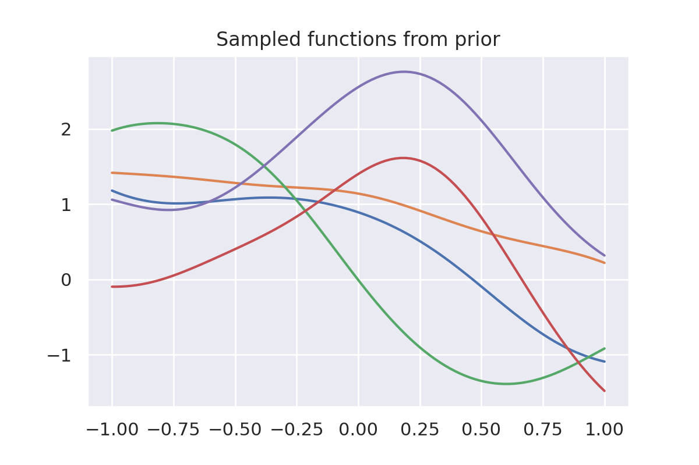
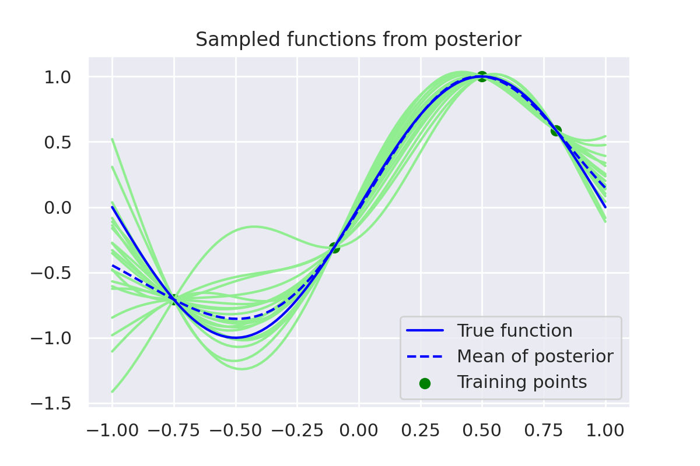
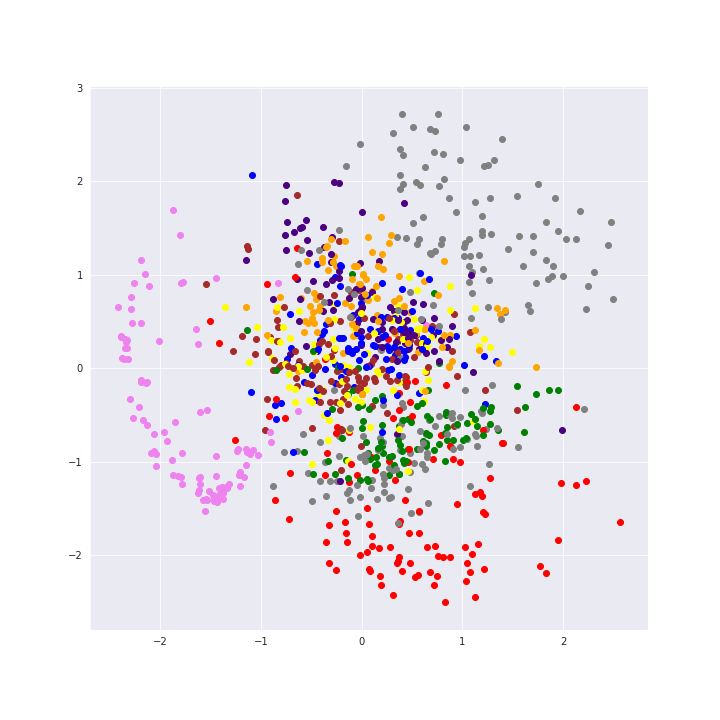
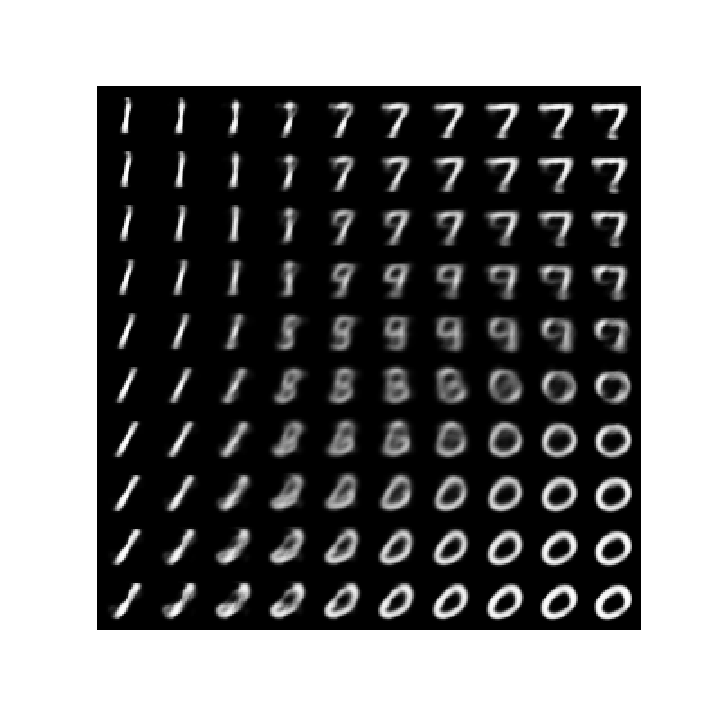
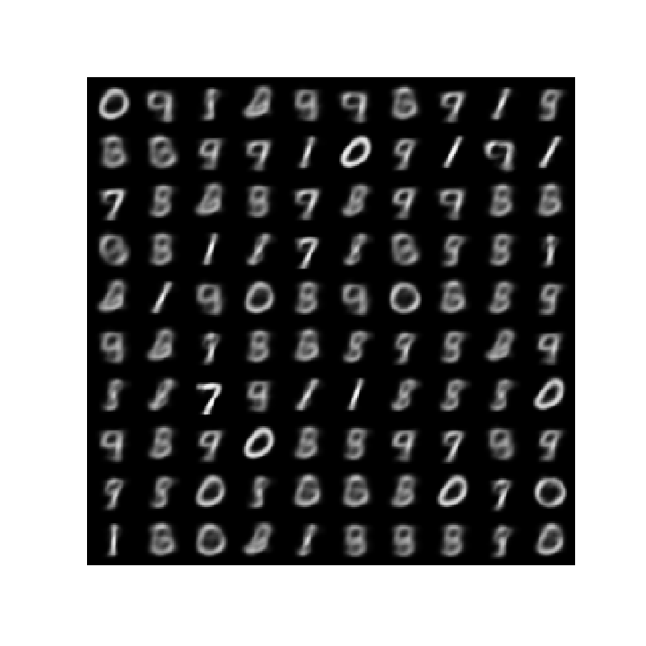
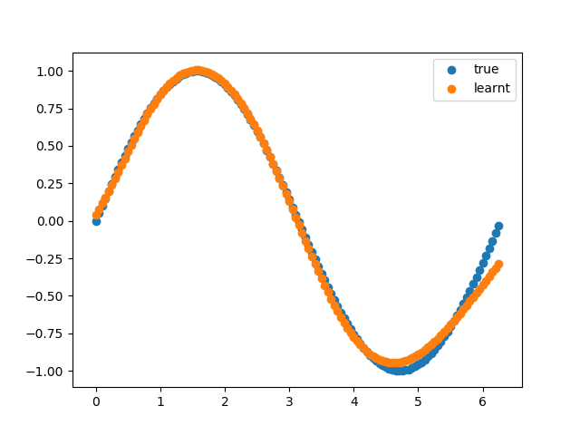
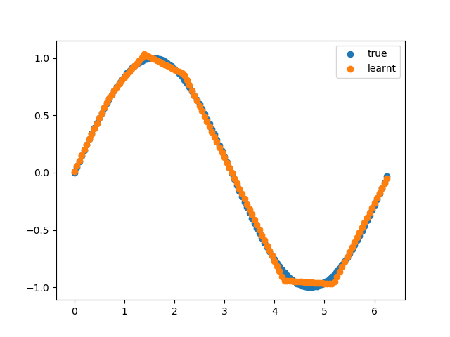

# Simple experiments mainly related to Machine Learning

In most of the following experiments, I try to implement things from scratch. The focus is on understanding rather than achieving the state-of-the-art results.

1. `Gaussian Process.ipynb`: Gaussian Process.

  

  	
  	
  

1. `VAE.ipynb`: Variational Autoencoder for MNIST.

	
	
    

1. `learn_transform.py`: Can a neural network learn forward and inverse trigonometric (sine/cosine/tangent) functions? My conclusion is that it can learn it in and around the regions where it has seen the data. Sigmoid activation works better than ReLU.

   

       
       
   

   

   

