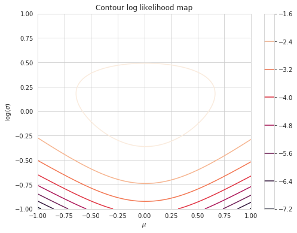
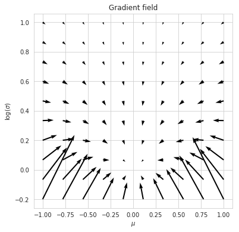
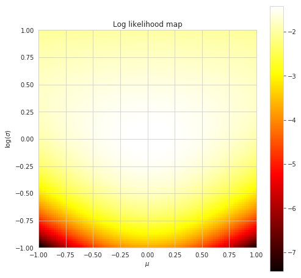

# Simple experiments on Machine Learning

In most of the following experiments, I try to implement things from scratch. The focus is on understanding rather than achieving the state-of-the-art results. So far I have implemented Gaussian Process, Variational Auto Encoder (VAE), Natural Gradient and Learning Trigonometric Functions using Neural Networks.

1. `Gaussian Process.ipynb`: Gaussian Process.
	

		
		
	

1. `VAE.ipynb`: Variational Autoencoder for MNIST.
	

		
		
	    
	

1. `Natural Gradient.ipynb`: Natural gradient to learn the parameters of a 1D Gaussian. Empirically I observe that natural gradient ascent converges faster than simple gradient ascent. Moreover, the KL divergence between 2 likelihood functions at consecutive training steps remains roughly the same during training. For theory on Natural Gradient I recommend reading [Agustinus Kristladl's Blog](https://wiseodd.github.io/techblog/2018/03/14/natural-gradient/#:~:text=Up%20to%20constant%20factor%20of,%E2%88%87%CE%B8L(%CE%B8).)
	

	    
	    
	    
	

1. `learn_transform.py`: Can a neural network learn forward and inverse trigonometric (sine/cosine/tangent) functions? My conclusion is that it can learn it in and around the regions where it has seen the data. Sigmoid activation works better than ReLU.
	

	    
	    
	

